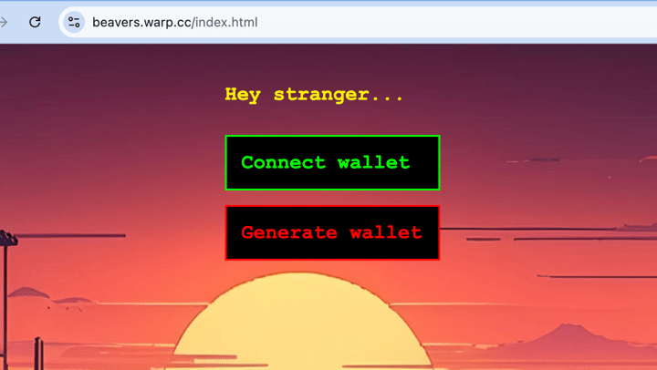
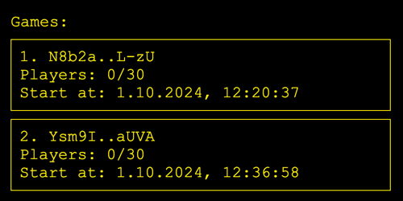
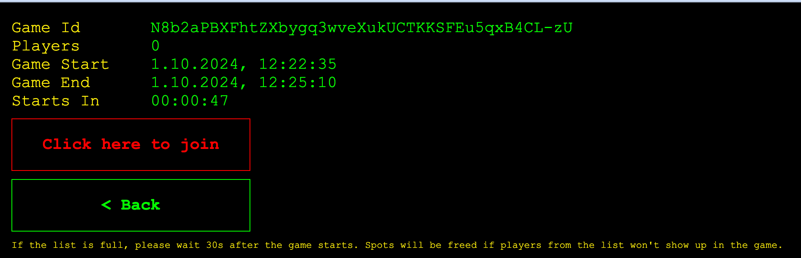
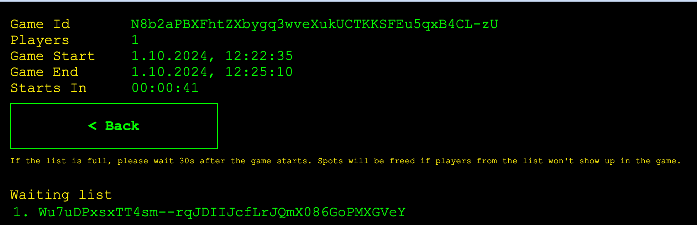
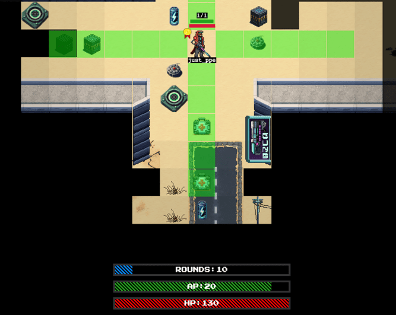
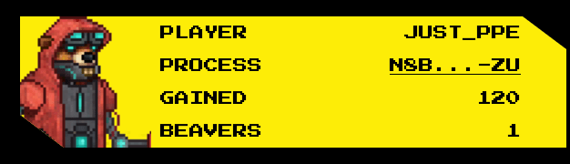
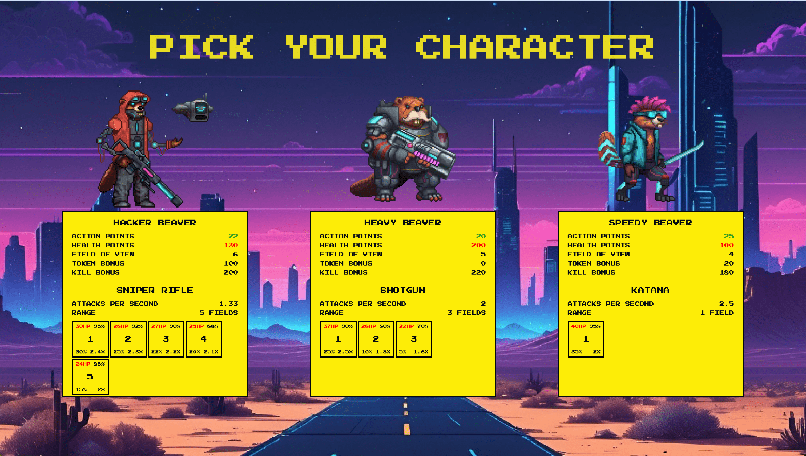
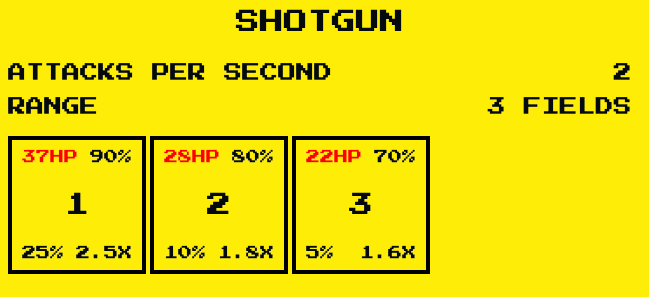
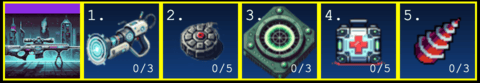
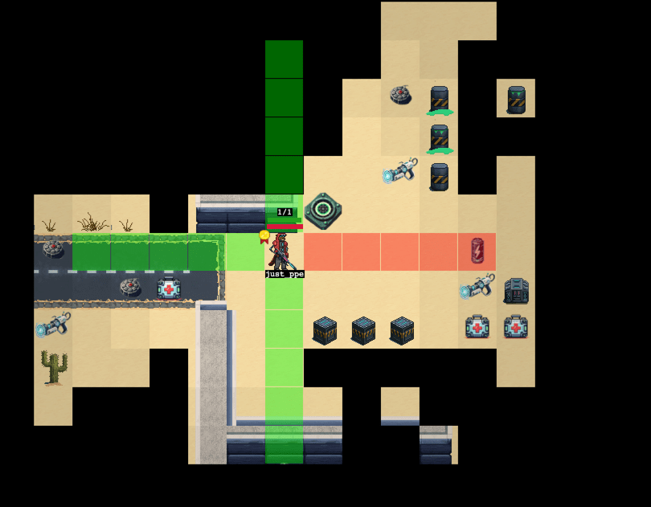

# CYBERPUNK BEAVERS

### Sign-in to Cyberbeavers Session

To join and play Cyberbeavers, a 100% on-chain multiplayer game made on AO the computer (https://x.com/aoTheComputer),
visit our Cyberbeaver Nodes and sign-in for a game at a specific date and time.
Signing in ensures you a spot in one of our exciting sessions, where players battle in fast-paced, 5-minute rounds across multiple game modes.

1. **Node 1** - https://beavers.warp.cc/  
   Best suited for players in Europe, Middle East, Africa, and the Americas.
2. **Node 2** - https://beavers-asia.warp.cc/  
   Ideal for players in Asia and the Pacific.

### Regular Gaming Hours

Games are organized in 30-minute sessions, with 5 games played per session.  
Each game lasts 5 minutes, offering a burst of action and strategy.

1. **Node 1**:
   - 14:00 - 14:30 UTC | 22:00 - 22:30 CST | 10:00 - 10:30 ET
   - Every Thursday and Friday
2. **Node 2**:
   - 13:00 - 13:30 UTC | 21:00 - 21:30 CST | 9:00 - 9:30 ET
   - Every Thursday and Friday

Use the opportunity to dive into the world of Cyberbeavers—sign in and compete for dominance, tokens & rewards!

In order to subscribe for a game:

1. Go to either EU or Asia server (depending on your location - this greatly affects the lags within a game)
2. Connect your wallet (note that you can also generate a wallet on the fly - but keep in mind that it will be
   stored in the browser's localStorage, and you won't be able to use your token rewards).
   
3. Choose a game that you wish to join to:  
   
4. Click the "Click here to join" button
   
5. You should see your wallet added to the players' list.
   

The game will automatically start at the "Game Start" time.

### About the game

Cyberpunk Beavers is multiplayer, top-down 2d shooting game with some unique mechanics.
The aim of the game is to gain the most amount of points and win in one of the available modes:

1. deathmatch - where players collect tokens and fight each others, respawning after each death
2. battle royale - where additionally the map shrinks in certain moments of the game and players are not
   respawned after death.
3. horde - players cooperate and try to defeat new waves of monsters

### Core mechanics

- The game runs in real-time, but is divided into rounds.
- In each round (which usually lasts 10s) each player has a certain amount of AP (Action Points)
  to spend on actions - moving, shooting, digging, collecting and using items, etc.
- Action Points are restored with each new round.
- If the player runs out of AP before the round ends, they
  cannot move until the end of this round - which makes them vulnerable for attacks of other players.  
  The current round and the amount of AP left to use are shown on the panel at the bottom of
  game screen:
    
  In the above example - we are at the end of round (and there are 10 rounds 'till the end of this game) and we still have 20 Action Points to use.
- Players need to explore the map - initially they see only a small portion of it. Objects behind obstacles (e.g. other players) are not visible.
  Parts of the map that are discovered, but are far away from the player are covered in fog of war (i.e. player do not see objects in this area)

### Gameplay modes

#### Deathmatch

- In this mode players are searching for treasures and fighting with each other (killing other player loots one random token).
- After each death - players are respawned in a random position.
- Each round lasts 10s. A typical game session takes 5 minutes.

#### Battle Royale

- In this mode map shrinks every few rounds. Before actual shrink players are warned and have to run away from
  the region that is going be shrinked. Should they fail to do so - they are immediately killed.
- Similarly to a deathmatch mode - players may search for the treasures hidden within a map.
- Players are not respawned in this mode (also after being killed by other player) - so watch out for you HP!
- All beavers in this mode have 2x the HP (in comparison to the deathmatch mode).
- Round in this mode lasts 5s and a typical game session - 2.5 minutes.
- At the end all players that managed to stay alive are additionally rewarded with either CB or RSG tokens.

#### Horde

- In this mode players cooperate and try to defeat new waves of enemies
- There is no friendly fire between players
- At max 10 players can fight together
- At max 10 monsters are spawned in each wave
- There are currently 6 type of monsters, each next type has more HP, deals more damage and has higher attack range
- Monsters can attack diagonally
- The higher the wave, the more dangerous monsters are spawned
- Between each wave players have a full round for healing, grabbing boosts, etc.
- There are 6 waves in total
- After beating all the waves - all the alive players are additionally rewarded
- Players are not respawned in this mode - so watch out for you HP! Med-kits restore more HP than in Deathmatch mode.
- All beavers in this mode have 2x the HP (in comparison to the deathmatch mode) and slightly more AP.
- Remember - healing and using boosts (shield, quad damage, etc.) is essential in this mode!

### Gaining points

You can gain points by

1. digging and collecting different tokens
2. collecting items
3. killing other players

Current points can be checked in the panel at the bottom-left of the game screen.
  
In the above example the player have already gained 120 points.

### Beaver selection screen

Before you enter the game, you need to choose the beaver that you want to play. There are 3 distinct types, with
different stats like HP, AP, weapons used, etc. All the details are visible in the panels under the given beaver.

In general:

1. Tech beaver has longest ranged weapon (5 fields)
2. Heavy beaver has most HP, the least AP and middle-ranged weapon (3 fields)
3. Speedy beaver has the most AP, the least HP and makes the most damage - but its weapon has only 1 field range.

#### Weapon details

The weapon details section contains information about the attack rate of the weapon and its stats for each possible range of the attack
  
In the above example (Shotgun) - player can perform at most 2 attacks per second. The weapon range is 3 fields.

- At the 1 field (i.e. when the target is next to player) - it deals 37HP damage, the hit chance is 90%, the critical hit chance
  is 25% and the critical hit multiplier is 2.5x (so a critical hit at this range would deal 92.5HP damage).
- For the field 3 (i.e. when the target is at the 3rd. field from the player) - it deals 22HP of damage with 70% change of hitting the target,
  the critical hit is only 5% and the critical hit multiplier is 1.6x

#### Boosts

There are several boosts, that can greatly increase your chances to win and survive.
In contrary to items - boosts are becoming active immediately after being picked.
Each boost (apart from the "map reveal") usually lasts for only 2 rounds.

1. quad damage - as the name implies, increases the damage 4x. Kill them all!
2. shield - reduces the damage taken while being hit.
3. map reveal - instantly reveals the whole map
4. xray - increases field of view (i.e. viewing range) and allows to see through obstacles.

### Controlling your beaver

1. **arrow keys** - move left, right, up, down
2. **numeric keys (1..9)** - use items from the backpack
   The currently owned items are shown in the panel in the bottom-right:
   
   - **"1" - teleport** - allows to quickly move to a different part of the map
   - **"2" - mine** - allows to deploy a mine - as a form of a trap for other players
   - **"3" - scanner** - scans the area around the beaver and reveals hidden tokens. The scan range is determined by weapon range.
   - **"4" - med-kit** - allows to restore health
   - **"5" - drill** - dig multiple holes in the ground based on specific radius; it allows to find game treasures
3. **d** - dig - you can dig in the ground in search for tokens. All collected tokens will be transferred to your wallet at the end of the game.
4. **c** - collect item
5. **tab** - show detailed info about collected tokens, players, etc.

### Attacking other players

**space + arrow** (i.e. press and hold space and while holding space - press arrow to choose the direction of the attack) - attack in the desired direction.  
The direction in which you are shooting is marked red on the range indicator - in the below example the beaver is shooting to the left.

### About the game - technical

Cyberpunk Beavers is a game that runs on [AO Computer](https://ao.arweave.dev/), using custom implementations
of the SU (Scheduler Unit), CU (Compute Unit) and MU (Messenger Unit) and AO Process implementation - optimized
for fast messages processing and high throughput.
