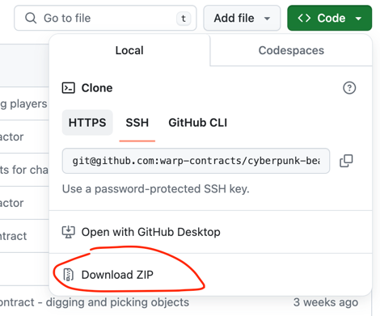
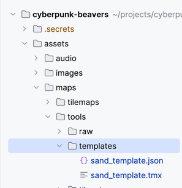
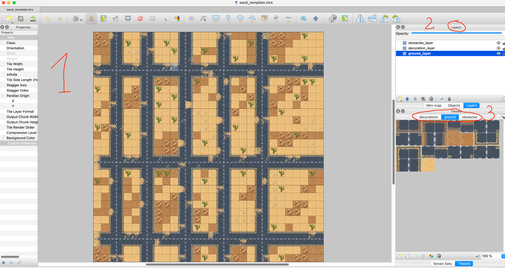
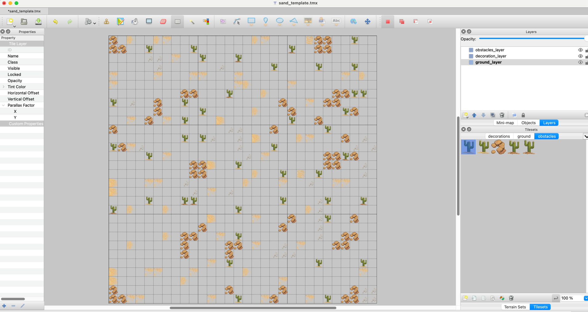
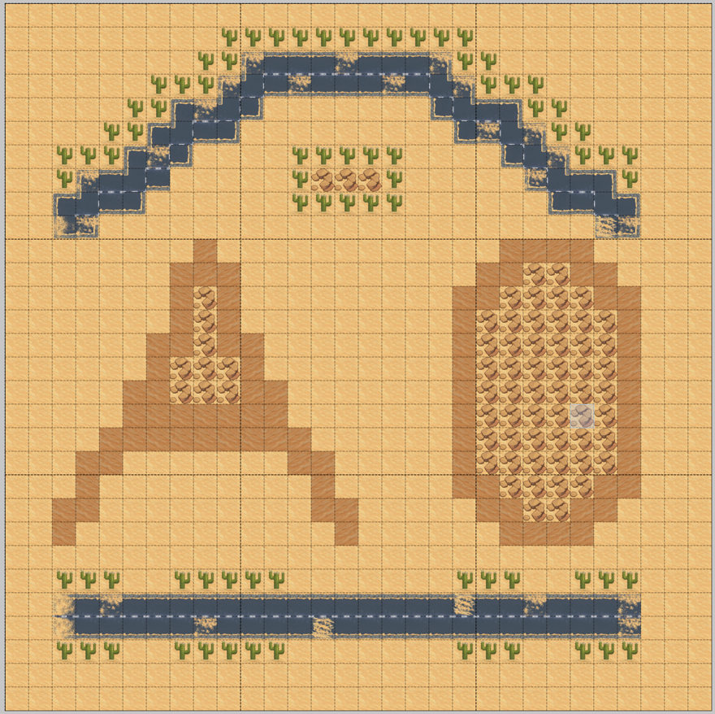
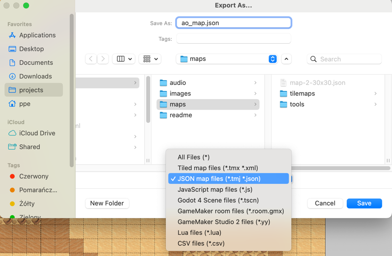
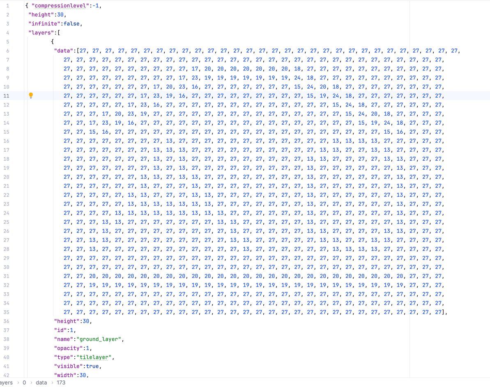
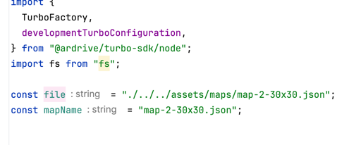
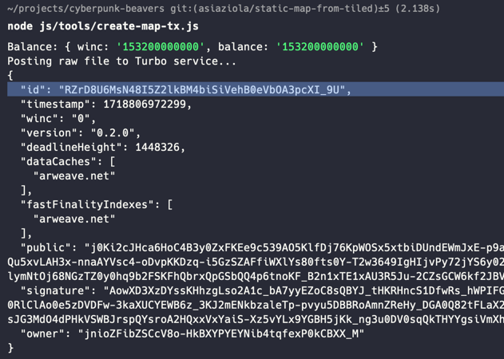

# CYBERPUNK BEAVERS

First of all, survive.
Attack: close combat, range attacks, surprises.
Defend, avoid getting hit, look for items and score points.
After a limited number of rounds, the game ends and a living beaver with the max points wins.

### In order to run the game

1. Build the game contract```
   `yarn build`

2. Start backend node.js server (Only if you prefer websockets, otherwise skip it)
   `yarn dev `

3. Start local static http server, e.g.
   `yarn serve`

4. Open the game at `http://localhost:9001/`


### Token

#### Wallet

In order to use jnio wallet in aos update the `$HOME/.aos.json`

#### Deploy

In lua directory run
`aos CyberBeaverToken`
`.load token.lua`

#### Transfer 

`Send({ Target = ao.id, Tags = { Action = "Transfer", Recipient = 'ksovq4pOatEoWzbxe8Iu8xeuhQshnoSpbKZ0TcDlMko', Quantity = '1000000' }})`

`Send({ Target = ao.id, Tags = { Action = "Balances" }})`


## Game Flow

Game slot lasts 6 minutes
 - 5 minutes game
 - 1-minute break
During break, first 30 seconds is Leaderboard.
Second 30 seconds is lounge area.

Every six minutes a cron is triggered which executes deploy scripts.
Deployment is as follows:
 - Build contract
 - Deploy new game contract and spawn it
 - Transfer tokens to game process
 - Set up game config, game start and end
 - Deploy new chat contract

Only a limited number of players can access the game.
Before the game begins there is a queue for players to register.


## Maps
Maps are created using the [Tiled](https://www.mapeditor.org/) editor.
In order to create a new map:  
1. [Download](https://thorbjorn.itch.io/tiled/download/eyJpZCI6Mjg3NjgsImV4cGlyZXMiOjE3MTg4NzAwODV9.hntXxFoxhdEGIhCFOT9LoTeul4M%3d) and install the editor.
2. Clone this repository (`git clone git@github.com:warp-contracts/cyberpunk-beavers.git`) or simply download it as a zip file from https://github.com/warp-contracts/cyberpunk-beavers

3. Go to `<your_path>/cyberpunk-beavers/assets/maps/tools/templates` directory.

4. Open the `sand_template.tmx` file.
5. The `Tiled` editor should open, and you should see something similar to:


### Map editor details
The main areas of the editor marked above are:
1. **Editor area** - this is a place, where you build you map - i.e. put tiles from a specific tileset on a specific layer
2. **Layers area** - these are the 3 layers that are defined for each map.
3. **Tilesets area** - these are 3 different tilesets that are meant to be used on a corresponding layer
   1. `ground` tileset on a `gound_layer` 
   2. `decorations` tileset on a `decoration_layer`
   3. `obstacles` tileset on a `obstacles_layer`
   
### Building your own map 
#### Clearing the template
1. Select the `ground_layer` in the `Layers` section
2. Select the whole map in the editor (`cmd+a` on Mac)
3. Remove all the selected tiles (`backspace` on Mac)
You should end-up with something similar to:

4. Repeat the above steps for the `decoration_layer` and `obstacles_layer`

**NOTE**: you can also start with simply editing the template - which is probably a better idea at start.
#### Adding elements
1. Select the `ground_layer` in the `Layers`
2. Select the `ground` tileset in the `Tilesets`  
**NOTE** Remember to choose a proper tileset for the layer that you're currently changing. Again:
   1. `ground` tileset on a `gound_layer` - this is the base layer, the tile type may affect the amount
   Action Points (AP) being used - e.g. the "road" tiles does not use any AP, the "light sand" tiles use 1 AP, "dark sand" use 2 AP, etc.
   2. `decorations` tileset on a `decoration_layer` - this a layer with "decorations" that can be placed on top
   of the base "ground" layer (e.g. some sand on the road). Some of the tiles from this group may also affect the 
   AP being used (e.g. the small stones use 3 APs).
   3. `obstacles` tileset on a `obstacles_layer` - the tiles on this layer block the movement entirely.
3. Select on of the tiles from the `ground` tiles - e.g. the "dark sand" tile.
4. Place it on the layer using the `Stamp Brush` tool   
**NOTE** Get familiar with other tools available, especially - `Bucket Fill Tool`, `Shape Fill Tool`, `Eraser`...
More details can be found [here](https://doc.mapeditor.org/en/stable/manual/editing-tile-layers/).
5. When you've finished the `ground_layer`, switch to the `decoration_layer` (and change the tileset to `decorations`!)
6. After the `decoration_layer` is finished - add some obstacles on the `obstacles_layer` (and switch tileset to `obstacles`).
After playing for a while you should have your map prepared - for example:


### Exporting the map
Assuming that you're happy with the results - it's time to export your map.  
Save it first as a new file - `File->Save As...`.  
Then go to `File->Export As...`, set a proper name (e.g. `ao_map.json`), file location and choose the `JSON map files` format.
  

The exported file should like similar to:  


### Posting the map to Arweave
Having the map exported, we can now post it to Arweave. You can do however you want to do it, an example script that is using
Turbo bundler is [here](https://github.com/warp-contracts/cyberpunk-beavers/blob/main/js/tools/create-map-tx.js).
If you want to use the above script:
1. set the `file` and the `mapName` variables.  

2. put your wallet in the `.secrets` directory
3. run the script using node.js `node js/tools/create-map-tx.js`.
You should see sth similar to a result:  

4. After posting the map to Arweave, please share your results on our Discord (i.e. the transaction id from the response in previous point and a screenshot of the map itself) - if it has interesting design and is formally correct -
   we might use it the game!

**NOTE**: if you're manually posting the map to Arweave, be sure to add these tags:
```json
[
   {
      "name": "Data-Protocol",
      "value": "warp-beavers-map"
   },
   {
      "name": "Name",
      "value": "<your-map-name>"
   },
   {
      "name": "Map-Api-Version",
      "value": "v1"
   },
   {
      "name": "Terrain",
      "value": "desert"
   }
]
```


   
