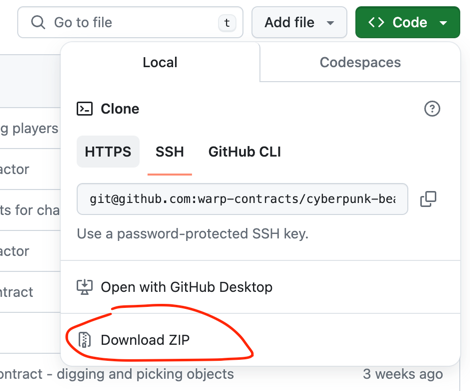
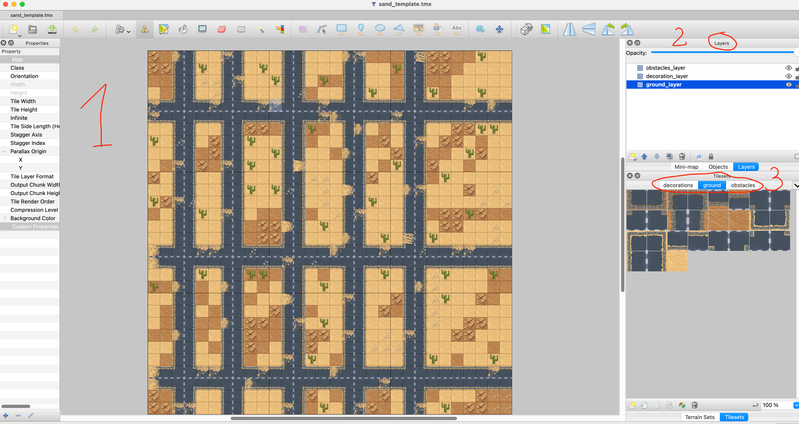
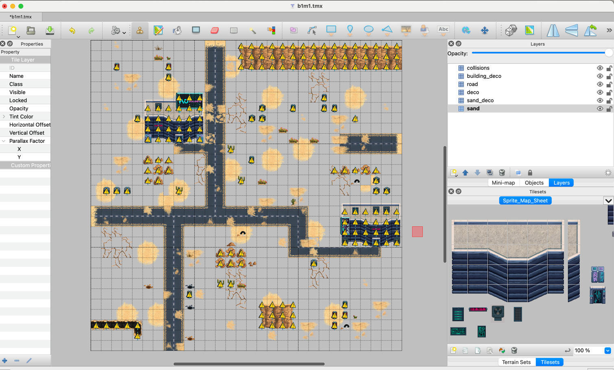
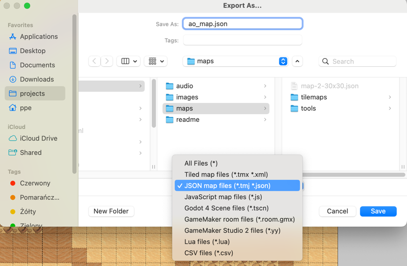
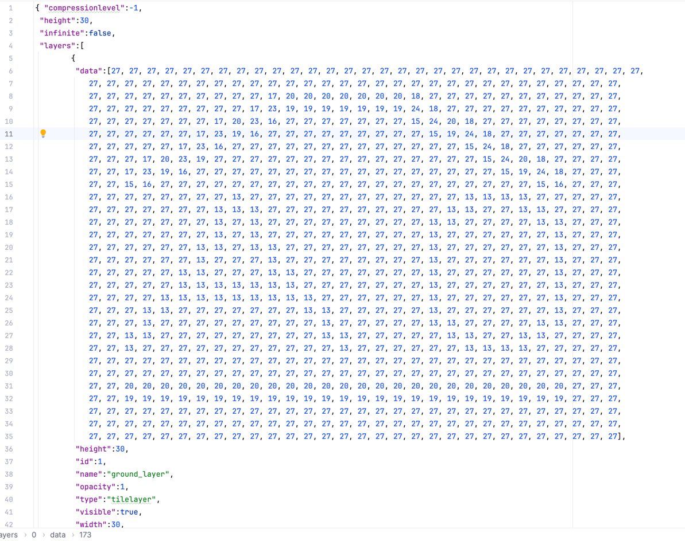
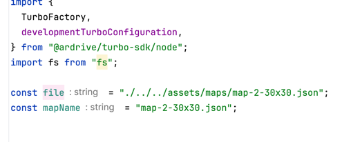
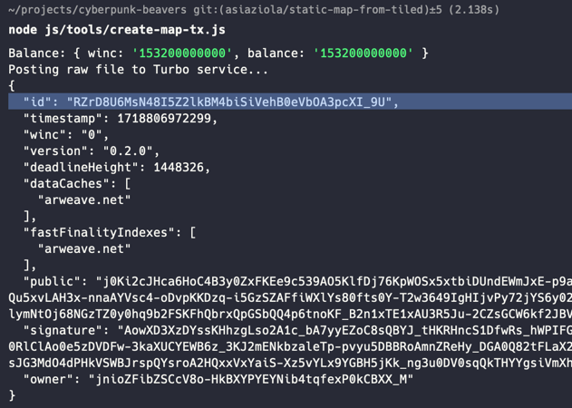

# CYBERPUNK BEAVERS

First of all, survive.
Attack: close combat, range attacks, surprises.
Defend, avoid getting hit, look for items and score points.
After a limited number of rounds, the game ends and a living beaver with the max points wins.

### In order to run the game

1. Build the game contract
   `yarn build`

2. Start backend node.js server (Only if you prefer websockets, otherwise skip it)
   `yarn dev `

3. Start local static http server, e.g.
   `yarn serve`

4. Open the game at `http://localhost:9001/`

### Spawning testing session

In order to deploy and spawn along with games:

`yarn deploy-session:local 23:20`
or
`node js/tools/deploy-spawn-session.js --env local  --time 23:20`

Games config can be found in of multiple json configuration files, for example
`./tools/deploy/config/session-local-ao.json`

In order to deploy and spawn a single game to the existing hub

`yarn deploy-session-game:local 23:20`
or
`node js/tools/deploy-spawn-session-game.js --env local  --time 23:20`

Omitting date in the commands above will result in spawning games without time limits

### Token

#### Wallet

In order to use jnio wallet in aos update the `$HOME/.aos.json`

#### Deploy

In lua directory run
`aos CyberBeaversToken`
`.load token.lua`

#### Transfer

`Send({ Target = ao.id, Tags = { Action = "Transfer", Recipient = 'ksovq4pOatEoWzbxe8Iu8xeuhQshnoSpbKZ0TcDlMko', Quantity = '1000000' }})`

`Send({ Target = ao.id, Tags = { Action = "Balances" }})`

## Game Flow

Game slot lasts 6 minutes

- 5 minutes game
- 1-minute break
  During break, first 30 seconds is Leaderboard.
  Second 30 seconds is lounge area.

Every six minutes a cron is triggered which executes deploy scripts.
Deployment is as follows:

- Build contract
- Deploy new game contract and spawn it
- Transfer tokens to game process
- Set up game config, game start and end
- Deploy new chat contract

Only a limited number of players can access the game.
Before the game begins there is a queue for players to register.

## Maps

Maps are created using the [Tiled](https://www.mapeditor.org/) editor.
In order to create a new map:

1. [Download](https://thorbjorn.itch.io/tiled/download/eyJpZCI6Mjg3NjgsImV4cGlyZXMiOjE3MTg4NzAwODV9.hntXxFoxhdEGIhCFOT9LoTeul4M%3d) and install the editor.
2. Clone this repository (`git clone git@github.com:warp-contracts/cyberpunk-beavers.git`) or simply download it as a zip file from https://github.com/warp-contracts/cyberpunk-beavers
   
3. Go to `<your_path>/cyberpunk-beavers/public/assets/maps/v2/` directory.
4. Open the `b1m1.tmx` file.
5. The `Tiled` editor should open, and you should see something similar to:
   

### Map editor details

The main areas of the editor are:

1. **Editor area** - this is a place, where you build you map - i.e. put tiles from a specific tileset on a specific layer
2. **Layers area** - these are the layers that are defined for each map.
3. **Tilesets area** - these are tilesets that are meant to be used wihtin layers

### Building your own map

#### Clearing the template

1. Select the `sand` in the `Layers` section
2. Select the whole map in the editor (`cmd+a` on Mac)
3. Remove all the selected tiles (`backspace` on Mac)
   You should end-up with something similar to:
   
4. Repeat the above steps for all the other layers

**NOTE**: you can also start with simply editing the template - which is probably a better idea at start.

#### Adding elements

1. Select the `sand` in the `Layers`
2. Select on of the tiles - e.g. the "light sand" tile (which is at the bottom of the tileset).
3. Place it on the layer using the `Stamp Brush` tool   
   **NOTE** Get familiar with other tools available, especially - `Bucket Fill Tool`, `Shape Fill Tool`, `Eraser`...
   More details can be found [here](https://doc.mapeditor.org/en/stable/manual/editing-tile-layers/).
4. Add more elements to the other layers - remember that you can also rotate/flip the existing tiles.

#### Rules of creating the layers

You can create any amount of layers with any names you like.  
The only rule is that there has to be a layer named `collissions` - where you have to mark (using any tile - we usually
use the 'warning sign' tile) parts of the map that are considered as obstacles and are not accessible for the players
(e.g. the buildings, barrels, signs, etc...).

### Exporting the map

Assuming that you're happy with the results - it's time to export your map.  
Save it first as a new file - `File->Save As...`.  
Then go to `File->Export As...`, set a proper name (e.g. `b1m10.json`), file location and choose the `JSON map files` format.


The exported file should like similar to:  


### Posting the map to Arweave

Having the map exported, we can now post it to Arweave. You can do however you want to do it, an example script that is using
Turbo bundler is [here](https://github.com/warp-contracts/cyberpunk-beavers/blob/main/tools/create-map-tx.js).
If you want to use the above script:

1. set the `file` and the `mapName` variables.  
   
2. put your wallet in the `.secrets` directory
3. run the script using node.js `node tools/create-map-tx.js`.
   You should see sth similar to a result:  
   
4. After posting the map to Arweave, please share your results on our Discord (i.e. the transaction id from the response in previous point and a screenshot of the map itself) - if it has interesting design and is formally correct -
   we might use it the game!

**NOTE**: if you're manually posting the map to Arweave, be sure to add these tags:

```json
[
  {
    "name": "Data-Protocol",
    "value": "warp-beavers-map"
  },
  {
    "name": "Name",
    "value": "<your-map-name>"
  },
  {
    "name": "Map-Api-Version",
    "value": "v2"
  },
  {
    "name": "Terrain",
    "value": "desert"
  }
]
```
